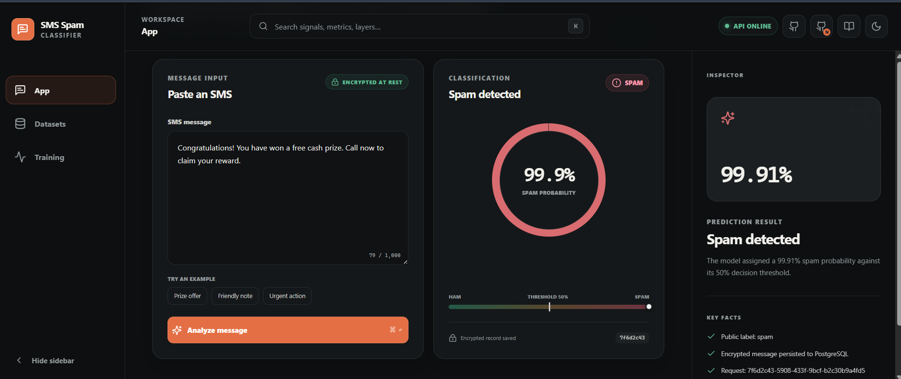
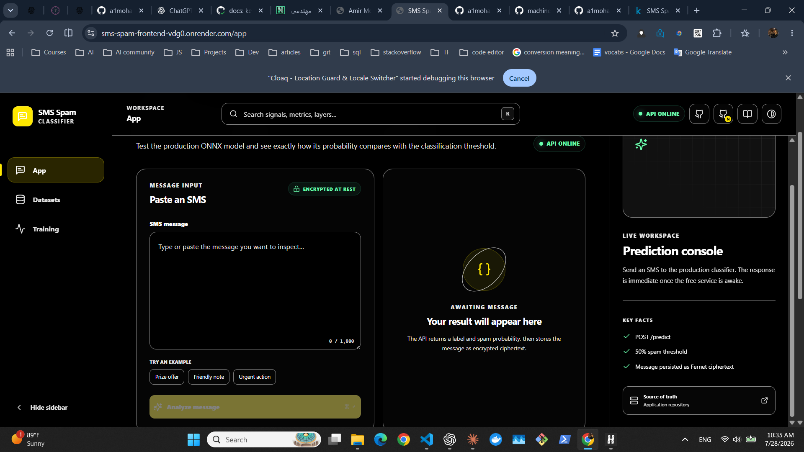
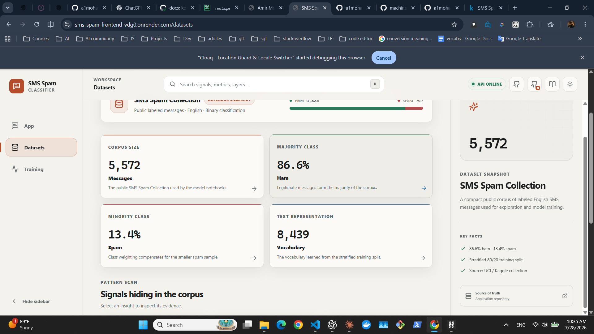
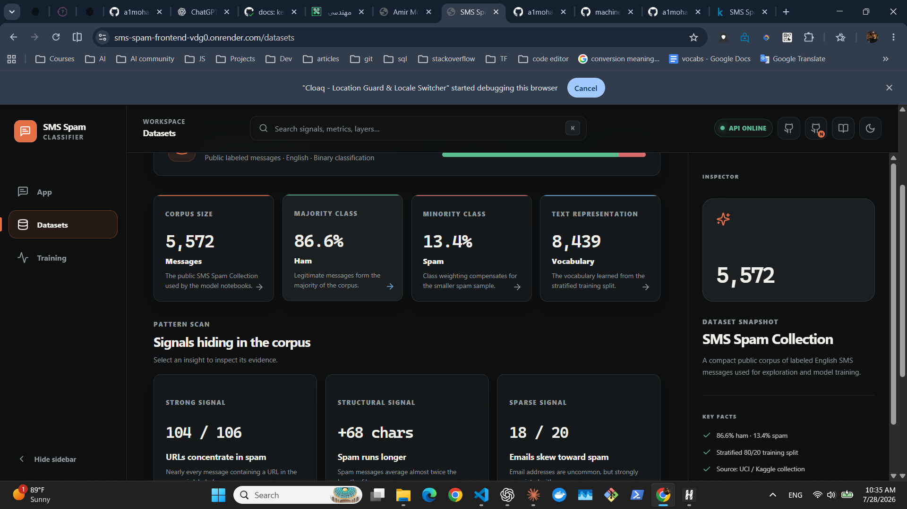
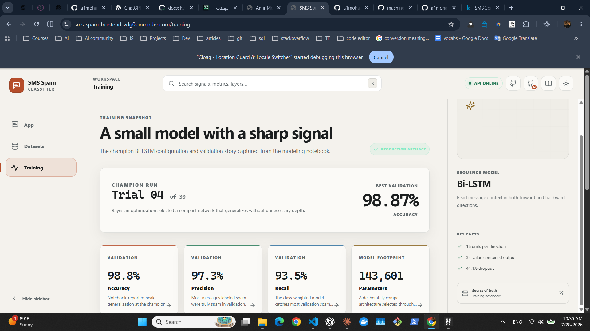
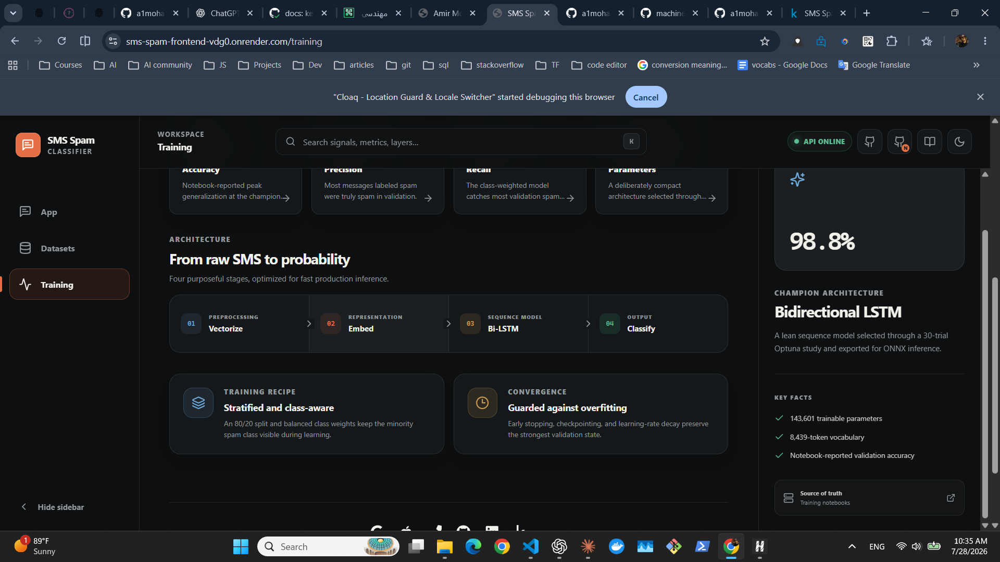

<div align="center">

# SMS Spam Classifier



### End-to-end SMS classification with a Bi-LSTM model, ONNX inference, encrypted PostgreSQL persistence, and a responsive React interface

[](https://www.python.org/)
[](https://fastapi.tiangolo.com/)
[](https://onnxruntime.ai/)
[](https://react.dev/)
[](https://www.typescriptlang.org/)
[](https://www.postgresql.org/)
[](https://www.docker.com/)
[](https://github.com/a1mohamad/sms-spam-app/actions/workflows/ci-cd.yml)
[](LICENSE)

**Live App and Services**

[](https://sms-spam-frontend-vdg0.onrender.com/)
[](https://sms-spam-api-gou5.onrender.com/docs)
[](https://sms-spam-api-gou5.onrender.com/health)


**Research and Data**

[](https://www.kaggle.com/datasets/uciml/sms-spam-collection-dataset)
[](https://a1mohamad.github.io/research/sms-spam/index.html)
[](https://github.com/a1mohamad/machine-learning-portfolio/tree/main/SMS%20Spam)
[](https://www.kaggle.com/code/amirmohamadaskari/sms-spam-classification-eda)
[](https://www.kaggle.com/code/amirmohamadaskari/sms-spam-classification-model)

**Contact and Profiles**

[](mailto:a1mohamad.askari@gmail.com)
[](mailto:amirmohmdaskari@icloud.com)
[](tel:+989012223122)
[](https://a1mohamad.github.io)
[](https://github.com/a1mohamad)
[](https://www.linkedin.com/in/amirmohammad-askari/)
[](https://www.kaggle.com/amirmohamadaskari)

</div>

**SMS Spam Classifier** is a production-oriented NLP project that turns a tuned
Bi-LSTM research model into an interactive web application. A FastAPI service
runs the exported ONNX model, encrypts every submitted message with Fernet, and
persists only ciphertext and prediction metadata to PostgreSQL.

The repository also contains a responsive React and TypeScript workspace for
live predictions, dataset exploration, and model inspection. Docker, Alembic,
GitHub Actions, Render, and Neon connect the research artifacts to a tested
deployment path.

> The Render services use a free plan and may need a short wake-up period after
> inactivity.

## Table of Contents

- [Live System](#live-system)
- [Overview](#overview)
- [Why This Project Matters](#why-this-project-matters)
- [Screenshots](#screenshots)
- [System Capabilities](#system-capabilities)
- [Dataset and Model Results](#dataset-and-model-results)
- [Model Pipeline](#model-pipeline)
- [System Architecture](#system-architecture)
- [Technology Stack](#technology-stack)
- [API Reference](#api-reference)
- [Security and Persistence](#security-and-persistence)
- [Runtime Configuration](#runtime-configuration)
- [Repository Structure](#repository-structure)
- [Quick Start](#quick-start)
- [Local Development](#local-development)
- [Docker Deployment](#docker-deployment)
- [Testing and CI/CD](#testing-and-cicd)
- [Model Artifact Workflow](#model-artifact-workflow)
- [Responsible AI](#responsible-ai)
- [Current Scope and Limitations](#current-scope-and-limitations)
- [Acknowledgments](#acknowledgments)
- [Citation](#citation)
- [License](#license)

---

## Live System

| Layer | Live Destination | Role |
|---|---|---|
| **Interactive application** | [Open the web app](https://sms-spam-frontend-vdg0.onrender.com/) | Submit SMS messages and inspect dataset and training evidence |
| **Prediction API** | [Swagger documentation](https://sms-spam-api-gou5.onrender.com/docs) | Explore and call the FastAPI contract |
| **Readiness check** | [API health endpoint](https://sms-spam-api-gou5.onrender.com/health) | Verify the API and PostgreSQL connection |
| **Research write-up** | [Project research page](https://a1mohamad.github.io/research/sms-spam/index.html) | Read the project narrative and results |
| **Research notebooks** | [GitHub research lab](https://github.com/a1mohamad/machine-learning-portfolio/tree/main/SMS%20Spam) | Inspect the EDA and model-development notebooks |
| **Source dataset** | [SMS Spam Collection on Kaggle](https://www.kaggle.com/datasets/uciml/sms-spam-collection-dataset) | Access the labeled SMS corpus |

The production browser calls `/api/*` on the frontend origin. Nginx proxies
those requests to the Render-hosted FastAPI service, so the UI does not require
browser-side cross-origin configuration.

---

## Overview

The project covers three connected views of the same classifier:

| Workspace | Purpose |
|---|---|
| **App** | Sends a message to the production classifier and visualizes the spam probability against the `0.5` threshold |
| **Datasets** | Presents corpus balance, vocabulary size, message-length patterns, URL frequency, and email-address signals |
| **Training** | Documents the champion Bi-LSTM configuration, validation metrics, model footprint, and inference stages |

The application separates model development from serving. TensorFlow and Keras
remain in the offline conversion workflow, while the production API installs
only ONNX Runtime and the dependencies needed for inference, validation,
encryption, and persistence.

---

## Why This Project Matters

- Research notebooks and deployable application code live in separate,
  purpose-built repositories.
- The vocabulary artifact comes from the stratified training split and is
  reused exactly during ONNX inference.
- Keras-to-ONNX conversion includes numerical parity validation before the
  exported model is treated as a runtime artifact.
- Plaintext SMS content never reaches the repository or PostgreSQL layer; the
  service encrypts it first with authenticated Fernet encryption.
- Alembic migrations run against Neon before GitHub Actions triggers Render
  deployment hooks.
- Component, browser, mobile, and automated WCAG A/AA checks exercise the
  frontend independently of the production service.

---

## Screenshots

### Prediction workspace



### Dataset workspace

| Light theme | Dark theme |
|---|---|
|  |  |

### Training workspace

| Champion model | Inference architecture |
|---|---|
|  |  |

---

## System Capabilities

### Classification

- Accepts an SMS message of `1` to `1,000` characters.
- Normalizes text to lowercase and removes punctuation.
- Maps tokens through the frozen `8,439`-entry training vocabulary.
- Pads or truncates every request to a `100`-token sequence.
- Runs CPU-friendly inference through ONNX Runtime.
- Returns `ham` or `spam` plus a spam probability in the range `0.0` to `1.0`.

### Interactive frontend

- Exposes dedicated App, Datasets, and Training workspaces.
- Visualizes the result against the configured `50%` classification threshold.
- Includes ready-to-run prize, friendly-note, and urgent-action examples.
- Provides searchable dataset metrics and model details with a keyboard
  shortcut.
- Adapts navigation and inspector panels for desktop and mobile layouts.
- Cycles through dark, light, and high-contrast themes.
- Stores only response metadata in browser session history, not submitted
  message text.

### API reliability

- Loads and warms the ONNX model once during application startup.
- Fails startup when required model, vocabulary, label, database, or encryption
  configuration is missing.
- Attaches an `X-Request-ID` correlation identifier to every HTTP response.
- Rejects oversized request bodies before JSON parsing.
- Returns stable, safe error codes without leaking model, database, or secret
  details.
- Uses PostgreSQL readiness queries for `/health`, not a process-only check.

### Persistence

- Encrypts SMS text before it enters the repository layer.
- Stores ciphertext, label, probability, decision threshold, message length,
  request ID, and server-generated timestamp.
- Enforces label, probability, threshold, length, and request-ID constraints in
  PostgreSQL.
- Uses request-scoped SQLAlchemy sessions with explicit commit and rollback
  behavior.
- Evolves the schema through Alembic migrations.

---

## Dataset and Model Results

The fixed [SMS Spam Collection dataset](https://www.kaggle.com/datasets/uciml/sms-spam-collection-dataset)
contains labeled English messages for binary classification.

### Dataset snapshot

| Class | Messages | Share |
|---|---:|---:|
| Ham | `4,825` | `86.6%` |
| Spam | `747` | `13.4%` |
| **Total** | **`5,572`** | **`100%`** |

The model workflow uses a stratified `80/20` split and class weights to keep
the minority spam class visible during training. The learned vocabulary
contains `8,439` entries.

### Notebook-reported champion results

| Metric | Result |
|---|---:|
| Validation accuracy | `98.8%` |
| Validation precision | `97.3%` |
| Validation recall | `93.5%` |
| Trainable parameters | `143,601` |
| Production threshold | `0.5` |

These are fixed validation results from the model notebook, not live production
telemetry. Precision and recall are shown alongside accuracy because the corpus
is imbalanced.

### EDA signals represented in the application

| Signal | Observation |
|---|---|
| URLs | `104` of `106` URL-containing messages are labeled spam |
| Message length | Spam averages `139` characters; ham averages `71` |
| Email addresses | `18` of `20` email-containing messages are labeled spam |

The [EDA notebook](https://www.kaggle.com/code/amirmohamadaskari/sms-spam-classification-eda)
contains the exploratory analysis, while the
[model notebook](https://www.kaggle.com/code/amirmohamadaskari/sms-spam-classification-model)
documents tuning and evaluation.

---

## Model Pipeline

```text
Raw SMS
   |
   v
Pydantic validation
   |-- trim surrounding whitespace
   |-- require 1..1,000 characters
   |-- enforce request-body byte limit
   v
Text standardization
   |-- lowercase
   |-- remove punctuation
   v
Frozen vocabulary lookup
   |-- unknown token fallback
   |-- pad or truncate to 100 tokens
   v
ONNX Bi-LSTM inference
   |
   v
Spam probability
   |
   +-- probability < 0.5  -> ham
   +-- probability >= 0.5 -> spam
   |
   v
Fernet encryption -> PostgreSQL persistence -> API response
```

### Champion architecture

| Stage | Configuration |
|---|---|
| **Vectorization** | Lowercase normalization, punctuation removal, fixed `100`-token sequences |
| **Embedding** | `8,439` vocabulary entries and `16` embedding dimensions |
| **Sequence model** | Bidirectional LSTM with `16` units per direction |
| **Regularization** | `44.4%` dropout |
| **Dense layer** | `128` ReLU units |
| **Output** | Single sigmoid probability |
| **Runtime export** | ONNX opset `13` |

---

## System Architecture

```text
                         +-------------------------+
                         | Browser                 |
                         | React + TypeScript      |
                         +------------+------------+
                                      |
                                      | HTTPS /api/*
                                      v
                         +------------+------------+
                         | Render frontend         |
                         | Nginx + static Vite SPA |
                         +------------+------------+
                                      |
                                      | reverse proxy
                                      v
                         +------------+------------+
                         | Render API              |
                         | FastAPI + Uvicorn       |
                         +------+------+-----------+
                                |      |
                     inference  |      | encrypted persistence
                                v      v
                    +-----------+-+  +-+----------------------+
                    | ONNX Runtime |  | Neon PostgreSQL       |
                    | Bi-LSTM      |  | SQLAlchemy + Alembic  |
                    +--------------+  +------------------------+
```

### Deployment flow

```text
Push to main
    |
    v
GitHub Actions
    |-- Python tests + migrations
    |-- frontend unit/component tests
    |-- Playwright browser + accessibility tests
    |-- Docker Compose deployment smoke test
    v
Apply Alembic migrations to Neon
    |
    v
Trigger Render API and frontend deploy hooks
```

---

## Technology Stack

| Layer | Technologies | Responsibility |
|---|---|---|
| **Research and training** | TensorFlow, Keras, Jupyter, Optuna notebooks | EDA, tuning, training, and champion selection |
| **Model packaging** | `tf2onnx`, ONNX, NumPy | Export and validate a portable runtime artifact |
| **Inference API** | Python 3.13, FastAPI, Uvicorn, Pydantic, ONNX Runtime | Validate requests and serve predictions |
| **Security** | `cryptography`, Fernet | Authenticated encryption for message content |
| **Persistence** | Neon, PostgreSQL, SQLAlchemy, Psycopg 3, Alembic | Store encrypted predictions and evolve the schema |
| **Frontend** | React 19, TypeScript, Vite, TanStack Query, Zod | Interactive prediction and research workspaces |
| **Web delivery** | Nginx | Serve the SPA, cache assets, and reverse-proxy API calls |
| **Frontend testing** | Vitest, Testing Library, MSW, Playwright, axe-core | Component, journey, responsive, and accessibility coverage |
| **Backend testing** | Pytest, HTTPX | Unit, API, integration, persistence, model, and smoke coverage |
| **Operations** | Docker, Docker Compose, Render, GitHub Actions | Reproducible local and production delivery |

---

## API Reference

The public API is available through
[interactive Swagger documentation](https://sms-spam-api-gou5.onrender.com/docs).

### Routes

| Method | Route | Purpose |
|---|---|---|
| `GET` | `/` | Return API name, version, and documentation path |
| `GET` | `/health` | Verify API readiness and PostgreSQL connectivity |
| `POST` | `/predict` | Classify and persist one encrypted SMS prediction |
| `GET` | `/docs` | Open Swagger UI |
| `GET` | `/openapi.json` | Retrieve the OpenAPI schema |

### Predict an SMS

```http
POST /predict
Content-Type: application/json
```

Request:

```json
{
  "text": "Congratulations! You have won a free cash prize."
}
```

PowerShell example:

```powershell
$body = @{
    text = "Congratulations! You have won a free cash prize."
} | ConvertTo-Json

Invoke-RestMethod `
    -Method Post `
    -Uri "https://sms-spam-api-gou5.onrender.com/predict" `
    -ContentType "application/json" `
    -Body $body
```

Response:

```json
{
  "label": "spam",
  "spam_probability": 0.991
}
```

| Field | Meaning |
|---|---|
| `label` | Binary decision: `ham` or `spam` |
| `spam_probability` | Model probability for the spam class, between `0.0` and `1.0` |
| `X-Request-ID` header | UUID that correlates the response, logs, and stored record |

The example probability illustrates the response shape; the model computes the
actual value for each submitted message.

### Input validation

| Condition | Result |
|---|---|
| Empty or whitespace-only text | `422 Unprocessable Entity` |
| Text longer than `1,000` characters | `422 Unprocessable Entity` |
| Raw request body larger than `16,384` bytes | `413 request_too_large` |
| Probability outside `0.0..1.0` or unknown label | Response validation fails safely |

Known runtime failures use a stable error envelope:

```json
{
  "error": {
    "code": "prediction_unavailable",
    "message": "Prediction is temporarily unavailable. Please try again.",
    "request_id": "aaaaaaaa-bbbb-cccc-dddd-eeeeeeeeeeee"
  }
}
```

---

## Security and Persistence

### Data handling

1. FastAPI validates the submitted text.
2. ONNX Runtime produces a prediction.
3. `MessageCipher` encrypts the original SMS with Fernet.
4. The service passes ciphertext—not plaintext—to the repository.
5. PostgreSQL stores the ciphertext and non-sensitive prediction metadata.

Fernet provides authenticated symmetric encryption: damaged or altered
ciphertext fails decryption. The application validates the encryption key at
startup so a missing or malformed key cannot surface only after the first user
request.

### Stored prediction record

| Field | Stored value |
|---|---|
| `request_id` | Unique UUID shared with the `X-Request-ID` response header |
| `message_ciphertext` | Fernet-encrypted SMS bytes |
| `label` | `ham` or `spam` |
| `spam_probability` | Model output in the range `0.0..1.0` |
| `threshold` | Decision threshold used for the request |
| `message_length` | Original character count |
| `created_at` | PostgreSQL-generated timestamp |

Secrets are supplied through environment variables and are excluded from the
repository. Database URLs are configured with SQLAlchemy parameter hiding, and
public error responses never include exception internals.

---

## Runtime Configuration

Copy the committed templates instead of committing real secrets:

```powershell
Copy-Item .env.example .env
Copy-Item frontend/.env.example frontend/.env.local
```

### API and database

| Variable | Default | Description |
|---|---|---|
| `DATABASE_URL` | Required | SQLAlchemy PostgreSQL connection URL |
| `MESSAGE_ENCRYPTION_KEY` | Required | URL-safe Fernet key used to encrypt SMS content |
| `THRESHOLD` | `0.5` | Minimum probability classified as spam |
| `MAX_LENGTH` | `100` | Fixed model input sequence length |
| `MAX_MESSAGE_LENGTH` | `1000` | Maximum SMS character count |
| `MAX_REQUEST_BODY_BYTES` | `16384` | Maximum raw HTTP request-body size |
| `DB_CONNECT_TIMEOUT_SECONDS` | `3` | PostgreSQL connection and pool timeout |
| `ARTIFACTS_DIR` | `artifacts` | Directory containing runtime model artifacts |
| `DB_PORT` | `5432` | Local PostgreSQL host port |
| `POSTGRES_DB` | `sms_spam` | Local database name |
| `POSTGRES_USER` | `your_local_user` | Local database user |
| `POSTGRES_PASSWORD` | Required | Local database password |

Generate a development Fernet key with:

```powershell
python -c "from cryptography.fernet import Fernet; print(Fernet.generate_key().decode())"
```

### Frontend variables

| Variable | Context | Description |
|---|---|---|
| `VITE_DEV_API_TARGET` | Vite development server | Target used by the local `/api` proxy |
| `API_UPSTREAM` | Nginx production container | Render API hostname used by the production reverse proxy |

---

## Repository Structure

```text
sms-spam-app/
|-- app/
|   |-- api/                  # routes, schemas, and safe error handlers
|   |-- core/                 # configuration, startup, and domain errors
|   |-- db/                   # SQLAlchemy engine and prediction model
|   |-- middleware/           # request IDs and request-body limits
|   |-- ml/                   # preprocessing and ONNX inference
|   |-- repositories/         # persistence operations
|   |-- security/             # Fernet message encryption
|   +-- services/             # prediction transaction orchestration
|-- artifacts/
|   |-- sms-spam-model.keras  # offline training artifact
|   |-- sms-spam-model.onnx   # production inference artifact
|   |-- vocabs_config.json    # frozen vocabulary and sequence settings
|   +-- label_mapping.json    # class ID to ham/spam mapping
|-- assets/screenshots/       # README application imagery
|-- frontend/
|   |-- e2e/                  # Playwright journeys and accessibility checks
|   |-- nginx/                # production proxy configuration
|   |-- src/                  # React application, API client, and tests
|   |-- Dockerfile            # Vite build and Nginx runtime image
|   +-- package.json
|-- migrations/               # Alembic database revisions
|-- scripts/                  # ONNX conversion, parity, and decrypt utilities
|-- tests/
|   |-- api/
|   |-- integration/
|   |-- smoke/
|   +-- unit/
|-- .github/workflows/ci-cd.yml
|-- docker-compose.yml
|-- Dockerfile
|-- Makefile
|-- render.yaml
+-- README.md
```

---

## Quick Start

The shortest complete path starts PostgreSQL, applies migrations, and launches
the API through Docker Compose.

```powershell
git clone https://github.com/a1mohamad/sms-spam-app.git
Set-Location sms-spam-app
Copy-Item .env.example .env
python -c "from cryptography.fernet import Fernet; print(Fernet.generate_key().decode())"
```

Place the generated key in `.env` as `MESSAGE_ENCRYPTION_KEY`, choose a local
`POSTGRES_PASSWORD`, then run:

```powershell
docker compose up --build --wait
```

Open <http://localhost:8000/docs>. Stop the stack without deleting the database
volume:

```powershell
docker compose down
```

---

## Local Development

### API

Python `3.13` is the tested runtime.

```powershell
python -m venv .venv
.\.venv\Scripts\Activate.ps1
python -m pip install --upgrade pip
python -m pip install -r requirements-dev.txt
```

Start PostgreSQL, apply migrations, and run the API with reload:

```powershell
docker compose up --detach --wait postgres
docker compose run --rm migrate
python -m uvicorn app.main:app --reload --port 8000
```

### Frontend development

Node.js `22` is used by CI and the production build image.

```powershell
Copy-Item frontend/.env.example frontend/.env.local
npm --prefix frontend install
npm --prefix frontend run dev
```

Set `VITE_DEV_API_TARGET=http://localhost:8000` in
`frontend/.env.local` to use the local API. Otherwise the committed example
targets the deployed Render API.

### Makefile shortcuts

| Command | Purpose |
|---|---|
| `make help` | List development and operations commands |
| `make check` | Validate Compose and run the safe backend test set |
| `make frontend-check` | Run frontend unit tests and a production build |
| `make up` | Build and start PostgreSQL, migrations, and the API |
| `make migrate` | Apply pending Alembic migrations |
| `make validate-parity` | Compare Keras and ONNX predictions |

---

## Docker Deployment

### API stack

The root Compose project orchestrates three services:

1. PostgreSQL `16` with a persistent local volume.
2. A one-off Alembic migration container.
3. The FastAPI application, which starts only after migrations succeed.

```powershell
docker compose up --build --wait
docker compose ps --all
```

The API image runs as an unprivileged user and excludes TensorFlow, Keras, and
the training model from the runtime layer.

### Frontend image

The frontend uses a multi-stage image: Node.js builds the Vite application,
then Nginx serves the static files on port `8080` and proxies `/api/*`.

```powershell
docker build --tag sms-spam-frontend frontend
docker run --rm --publish 8080:8080 sms-spam-frontend
```

The Render Blueprint in `render.yaml` defines the API and frontend services,
health checks, environment variables, and Docker build contexts.

---

## Testing and CI/CD

### Backend

```powershell
python -m pytest -m "not database and not deployment"
```

The Python suite covers configuration, preprocessing, predictor behavior,
encryption, repository transactions, database constraints, API schemas, safe
errors, artifact loading, ONNX inference, persistence, and process/container
smoke paths.

### Frontend

```powershell
npm --prefix frontend run test:unit
npm --prefix frontend run build
npm --prefix frontend exec -- playwright install chromium
npm --prefix frontend run test:e2e
```

Vitest, Testing Library, and MSW test components without writing to Neon.
Playwright exercises desktop and mobile navigation, prediction journeys,
responsive inspector behavior, all three themes, and automated WCAG A/AA
checks through axe-core.

### Continuous delivery

The GitHub Actions workflow runs four gated stages:

1. Backend tests, PostgreSQL migrations, and application smoke checks.
2. Frontend unit tests, production build, Playwright, and accessibility checks.
3. A full Docker Compose deployment smoke test with persisted prediction
   verification.
4. Production Alembic migrations on Neon, followed by Render API and frontend
   deploy hooks.

Pull requests run the validation stages without deploying production.

---

## Model Artifact Workflow

Runtime inference depends on three committed artifacts:

| Artifact | Purpose |
|---|---|
| `artifacts/sms-spam-model.onnx` | Portable production inference graph |
| `artifacts/vocabs_config.json` | Frozen vocabulary and sequence length |
| `artifacts/label_mapping.json` | Maps model class IDs to `ham` and `spam` |

The Keras model is retained for reproducible conversion but is not copied into
the production API image.

```powershell
python -m pip install -r requirements-convert.txt
python scripts/convert_to_onnx.py
python scripts/validate_keras_onnx_parity.py
```

Parity validation runs Keras and ONNX on the same preprocessed messages and
requires their outputs to agree within `1e-4` relative and absolute tolerance.

---

## Responsible AI

This application is a research and portfolio demonstration, not a complete
telecommunications spam-control system.

- A spam prediction is a model estimate, not proof that a sender is malicious.
- The model is trained on a fixed English-language SMS corpus and may not
  generalize to other languages, regions, time periods, or messaging channels.
- Adversarial spelling, unusual punctuation, emerging scam patterns, and
  context-dependent messages can produce false positives or false negatives.
- The UI exposes probability and threshold information so the decision is not
  presented as unexplained certainty.
- A real consumer deployment would require monitoring, drift evaluation,
  abuse controls, retention policy, and a human-review path for consequential
  decisions.

---

## Current Scope and Limitations

Current scope:

- Binary English SMS classification as `ham` or `spam`
- Single-message prediction through the web app or REST API
- Encrypted prediction persistence in PostgreSQL
- CPU-oriented ONNX inference
- Research, dataset, and model-inspection workspaces

Current limitations:

- The public prediction endpoint has no user authentication, quota, or
  application-level rate limiting.
- Fernet is symmetric encryption; anyone with the application key and database
  access can decrypt stored messages.
- The fixed vocabulary maps unseen words to an unknown token and does not learn
  from production traffic.
- The classification threshold is globally configured rather than calibrated
  per user or risk context.
- Free Render instances can sleep, making the first request slower.
- Production drift, fairness, latency, and false-positive rates are not yet
  monitored as live telemetry.

A production expansion would add identity and rate controls, key rotation,
retention enforcement, observability, drift monitoring, and periodic
retraining with representative reviewed data.

---

## Acknowledgments

- [UCI SMS Spam Collection](https://archive.ics.uci.edu/dataset/228/sms+spam+collection)
  and its [Kaggle distribution](https://www.kaggle.com/datasets/uciml/sms-spam-collection-dataset)
  provide the labeled corpus.
- The [research lab](https://github.com/a1mohamad/machine-learning-portfolio/tree/main/SMS%20Spam)
  contains the source EDA and model notebooks used to produce the application
  artifacts.
- FastAPI, ONNX Runtime, React, PostgreSQL, and the open-source testing
  ecosystem provide the deployment foundation.

---

## Citation

```bibtex
@software{askari_sms_spam_classifier_2026,
  author = {Askari, Amir Mohammad},
  title  = {SMS Spam Classifier},
  year   = {2026},
  url    = {https://github.com/a1mohamad/sms-spam-app}
}
```

---

## License

This project is licensed under the MIT License. See [LICENSE](LICENSE) for
details.
